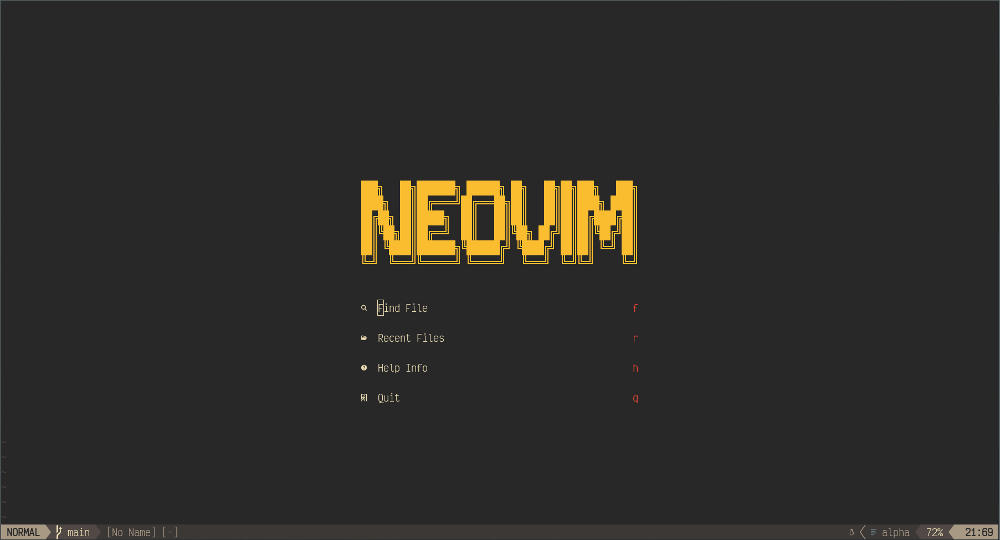
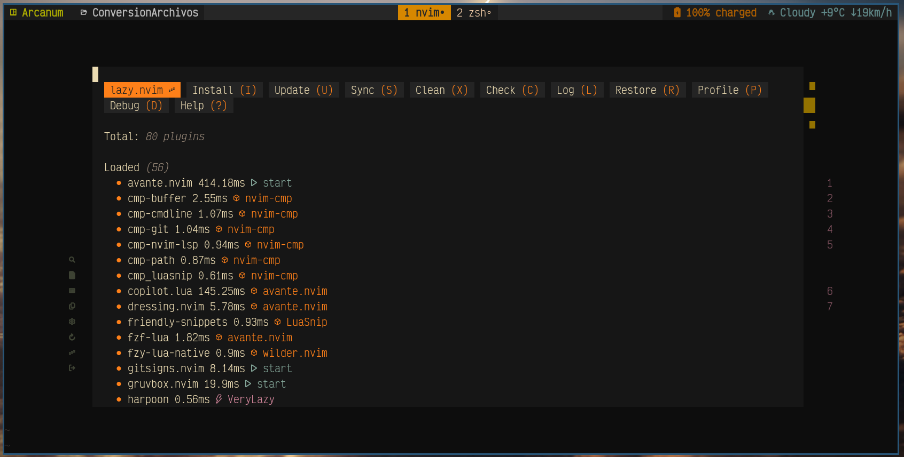
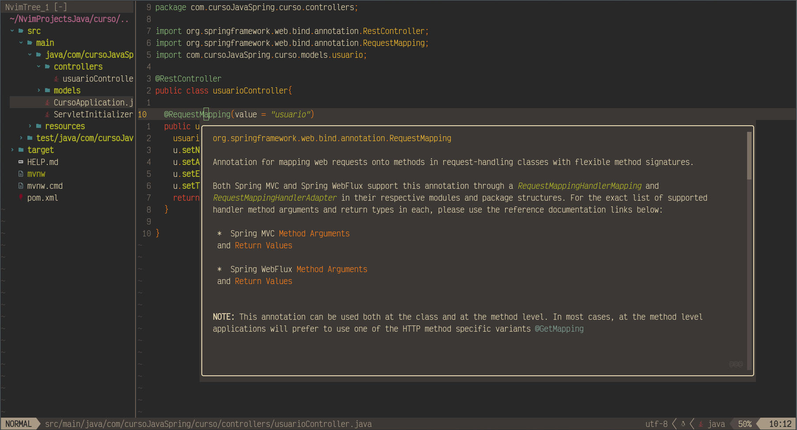
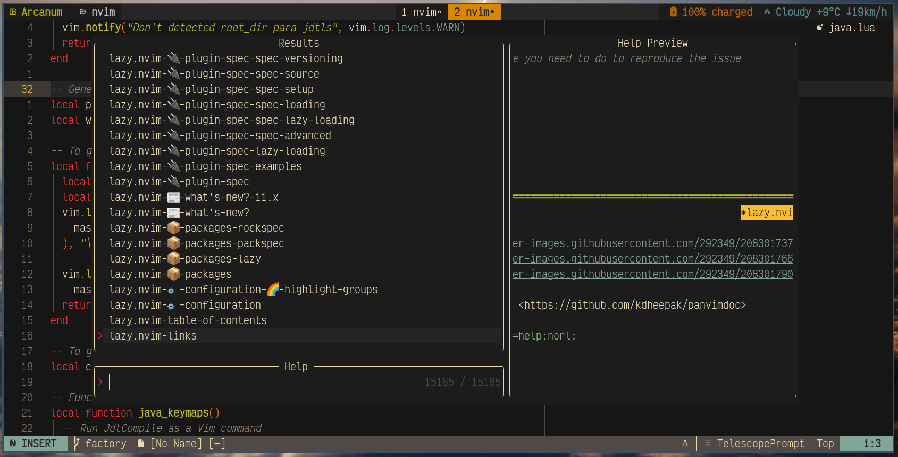
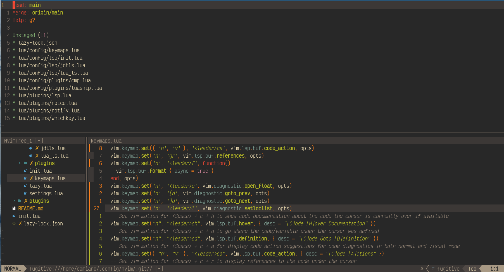
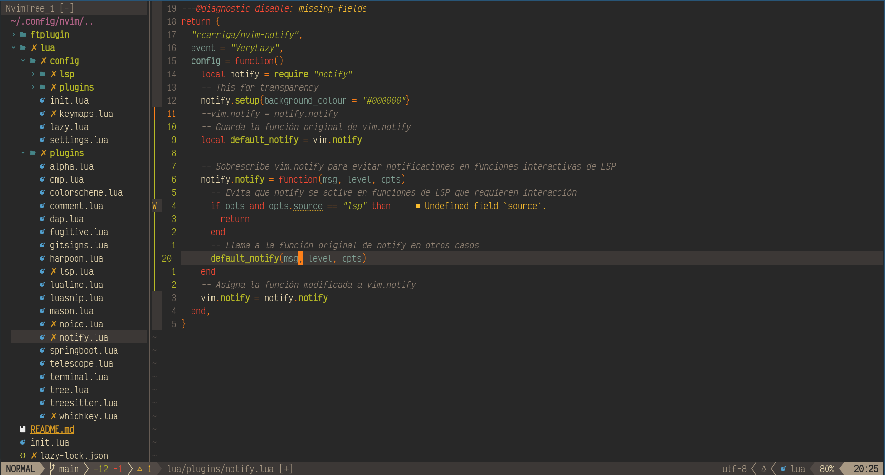

# NEOVIM Configuration

A personal and optimized Neovim setup for a smooth and efficient development experience. This configuration is tailored for performance, featuring plugins for better code navigation, completion, and customization.



## 🚀 Features
- **Lazy-loaded plugins** for better performance
  
- **Tree-sitter** for improved syntax highlighting
  
- **LSP and DAP** support for a full coding experience
  
- **Telescope** for fuzzy file searching
  
- **Git integration** with gitsigns and fugitive
  
- **Custom key mappings** for efficiency
  .
- **ToggleTerm** for an integrated terminal
  

## 📥 Installation
Clone this repository and place the configuration files in your Neovim directory:

```sh
git clone https://github.com/damianp91/NEOVIM-config ~/.config/nvim
```

Ensure you have Neovim (latest stable version) installed.

### Dependencies
- Neovim (v0.10+)
- Git
- Node.js (for LSP functionality)
- Python3 (for some plugins)
- Ripgrep (for Telescope)

## 🛠️ Setup
After cloning, open Neovim and run:

```sh
nvim
```

The plugins will automatically install on the first run.

## 🎯 Keybindings
Some useful shortcuts:
- `<leader>ff` → Find files with Telescope
- `<leader>fg` → Grep in files
- `<leader>gs` → Git status
- `<leader>r` → Run the current file
- `<leader>tn` → Open terminal

## 📜 License
This configuration is open-source and available under the MIT License.
---


