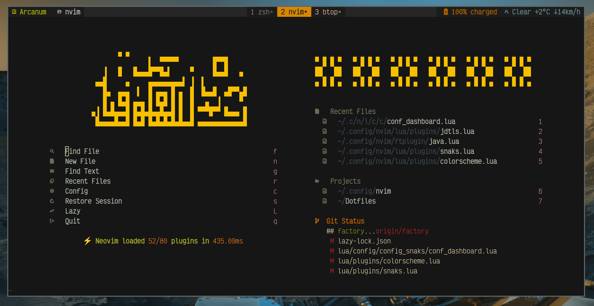
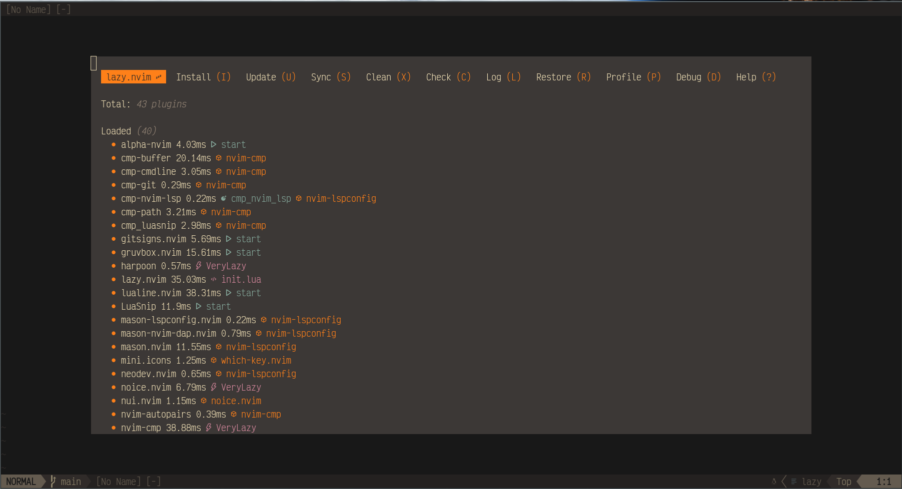
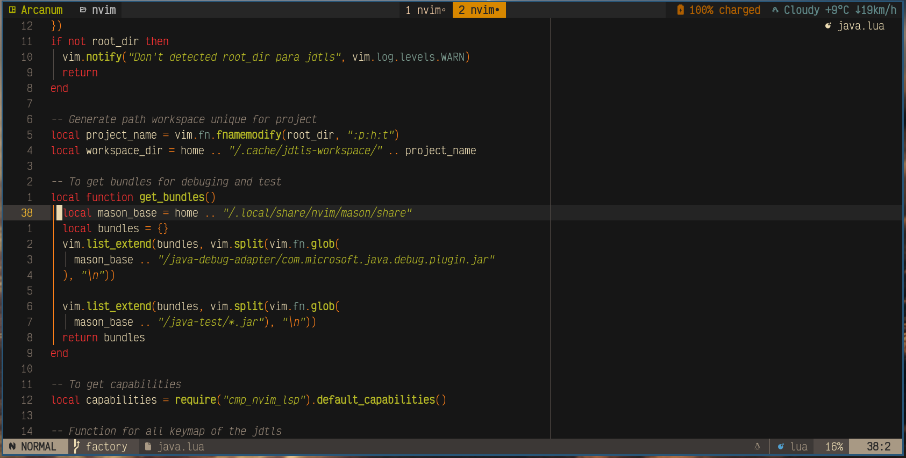
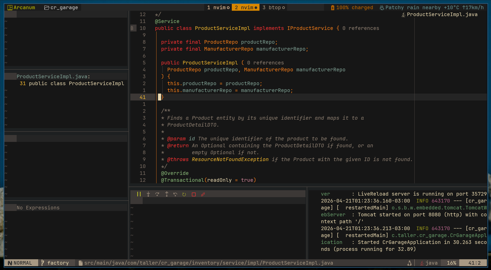
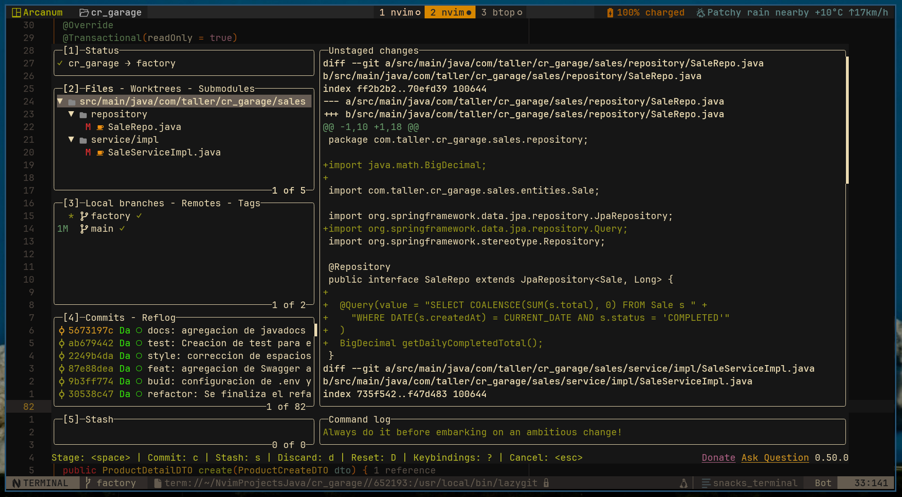
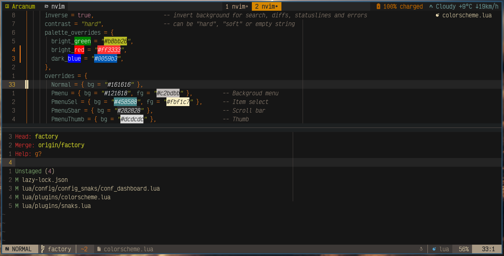
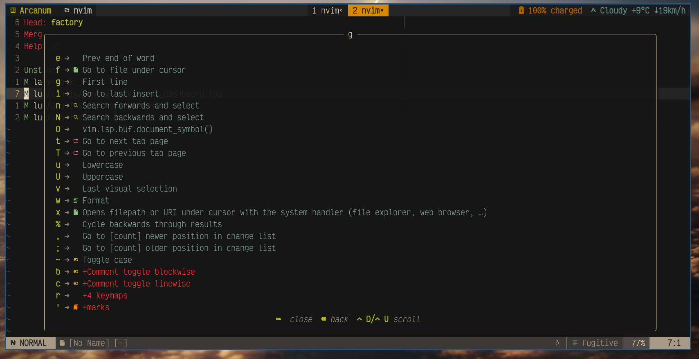
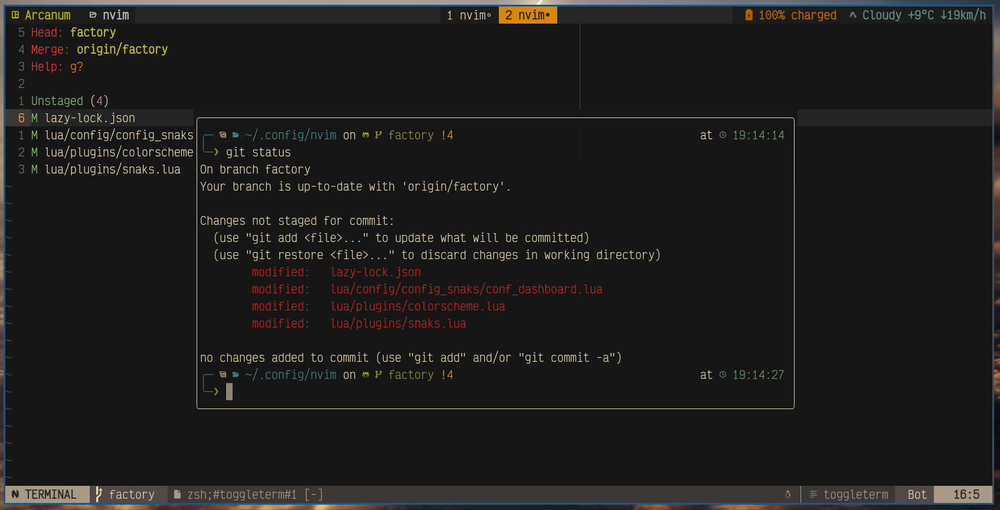
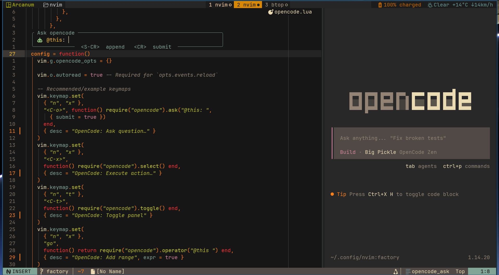

# NEOVIM Configuration

A personal and optimized Neovim setup for a smooth and efficient development experience. This configuration is tailored for performance, featuring plugins for better code navigation, completion, and customization.



## 🚀 Features
- **Lazy-loaded plugins** for better performance
  
- **Tree-sitter** for improved syntax highlighting
  
- **LSP and DAP** support for a full coding experience
  
- **Telescope** for fuzzy file searching
  
- **Git integration** with gitsigns and fugitive
  
- **Custom key mappings** for efficiency
  .
- **ToggleTerm** for an integrated terminal
  
- OpneCode integrated
    

## 📥 Installation
Clone this repository and place the configuration files in your Neovim directory:

```sh
git clone https://github.com/damianp91/NEOVIM-config ~/.config/nvim
```

Ensure you have Neovim (latest stable version) installed.

> [!IMPORTANT]
> This configuration isn't yet available for *Neovim 0.12*. Futhermore, once the version
> is stable, thsi configuration will be adoped.

### Dependencies
- Neovim (v0.10+)
- Git
- Node.js (for LSP functionality)
- Python3 (for some plugins)
- Ripgrep (for Telescope)
- LazyGit (for use plugin of lazygit)
## 🛠️ Setup
After cloning, open Neovim and run:

```sh
nvim
```

The plugins will automatically install (Mason) on the first run.

## 🎯 Keybindings

Some useful shortcuts:
- `<leader>ef` → Find files with Snak.pikers
- `<leader>pg` → Grep in files
- `<leader>gs` → Git status
- `<leader>r` → Reload curren buffer.
- `<leader>tf, <leader>tv, <leader>th` → Open terminal
- `<leader>uo` → Open panel OpenCode 
The keymaps are grouped for better search and flow in which key.

## 📜 License
This configuration is open-source and available under the MIT License.
---


